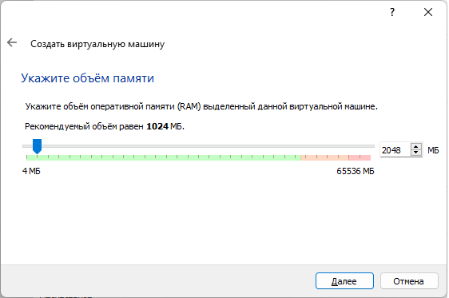

*[К оглавлению](index.md)*
- Установка linux
    - 1 Необходимо скачать VirualBox и образ Linux Ubuntu.
    - 2 Установить VirualBox
    - 3 Создать виртульную машину
    - 4 Установить на нее Ubuntu

