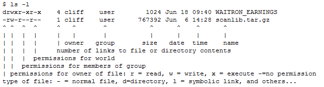

*[К оглавлению](index.md)*
- Первые комманды
    - **man**
        - *Все, что вам нужно знать о Linux, можно найти в man. Это интерфейс, используемый для просмотра справочных руководств системы, отсюда и название: man - сокращение от manual.*
        - [Подробнее](https://losst.ru/chto-takoe-man)
    - **ls**
        - *Команда ls происходит от слова list — список. Подробный список файлов.*
        
        - [Подробнее](https://losst.ru/komanda-ls-linux)
    - **pwd**
        - *Команда pwd сокращение от анг. print working directory и дословно переводится как “вывести рабочую директорию”*
        - [Подробнее](https://losst.ru/komanda-pwd-linux)
    - **cd**
        - *(англ. change directory — изменить каталог) — команда командной строки для изменения рабочего каталога в Unix, DOS и других операционных системах*
        - [Подробнее](https://losst.ru/komanda-cd-linux)
    - **mkdir**
        - *(от англ. make directory) в операционной системе Unix, Linux, DOS, OS/2, Windows — команда для создания новых каталогов*
        - [Подробнее](https://pingvinus.ru/note/cmd-mkdir)
    - **touch**
        - *Команда Unix, предназначенная для установки времени последнего изменения файла или доступа в текущее время. Также используется для создания пустых файлов.*
        - [Подробнее](https://lumpics.ru/command-touch-in-linux/)
    - **cat**
        - *Название команды - это сокращения от слова catenate. По сути, задача команды cat очень проста - она читает данные из файла или стандартного ввода и выводит их на экран.*
        - [Подробнее](https://losst.ru/komanda-cat-linux)
    - **more**
        - *Своим названием она обязана надписи more (в русскоязычном варианте — дальше), появляющейся внизу каждой страницы.*
        - [Подробнее](https://losst.ru/komanda-more-v-linux)
    - **less**
        - *Программа для текстовых терминалов UNIX-подобных систем, используемая для просмотра (но не изменения) содержимого текстовых файлов на экране.*
        - [Подробнее](https://losst.ru/komanda-less-v-linux)
    - **chmod**
        - *(от англ. change mode) — команда для изменения прав доступа к файлам и каталогам, используемая в Unix-подобных операционных системах*
        - [Подробнее](https://losst.ru/komanda-chmod-linux)
    - **chown**
        - *Сокращение от “сменить владельца” (англ. “Change owner”)*
        - [Подробнее](https://losst.ru/komanda-chown-linux)
    - **rm**
        - *Базовая команда в Unix и Unix-подобных операционных системах, используемая для удаления объектов, таких как компьютерные файлы, каталоги и символические ссылки, из файловых систем, а также специальных файлов, таких как узлы устройств, каналы и сокеты.*
        - [Подробнее](https://pingvinus.ru/note/cmd-rm)
    - **du**
        - *Сокращенно от «использование диска», сообщает приблизительный объем дискового пространства, используемого данными файлами или каталогами. Это практически полезно для поиска файлов и каталогов, занимающих много места на диске.*
        - [Подробнее](https://losst.ru/komanda-du-v-linux)
    - **df**
        - *Расшифровывается как «дисковая файловая система», она используется для получения полной сводной информации об использовании доступного и используемого дискового пространства файловой системы в системе Linux.*
        - [Подробнее](https://losst.ru/komanda-df-linux)
    - **mv**
        - *Название этой команды является сокращением слова move. Переименовать файл можно с помощью команды: mv имя_файла новое_имя.*
        - [Подробнее](https://lumpics.ru/command-mv-in-linux/)
    - **cp**
        - *Команда cp происходит от слова copy, т.е. копирование. Позволяет копировать файлы и каталоги.*
        - [Подробнее](https://pingvinus.ru/note/cmd-cp)
    - **tail**
        - *Команда Tail позволяют пользователю читать команды файла с конца. *
        - [Подробнее](https://losst.ru/komanda-tail-linux)
    - **head**
        - *Как видно из названия, команда head отображает первые N строк данных*
        - [Подробнее](https://losst.ru/komanda-head-linux)
    - **find**
        - *Утилита поиска файлов по имени и другим свойствам, используемая в UNIX‐подобных операционных системах.*
        - [Подробнее](https://losst.ru/komanda-find-v-linux)
    - **grep**
        - *Это утилита командной строки для поиска в текстовых наборах данных строк, соответствующих регулярному выражению. Его название происходит от команды ed g/re/p (глобальный поиск регулярного выражения и печать соответствующих строк), которая имеет тот же эффект.*
        - [Подробнее](https://losst.ru/gerp-poisk-vnutri-fajlov-v-linux)
    - **sudo**
        - *(англ. Substitute User and do, дословно «подменить пользователя и выполнить») — программа для системного администрирования UNIX-систем, позволяющая делегировать те или иные привилегированные ресурсы пользователям с ведением протокола работы*
        - [Подробнее](https://losst.ru/komanda-sudo-v-linux)
    - **vim**
        - *(сокр. от Vi Improved, произносится «вим») — кошмар для случайного пользователя.*
        - [Подробнее](https://losst.ru/kak-polzovatsya-tekstovym-redaktorom-vim)
